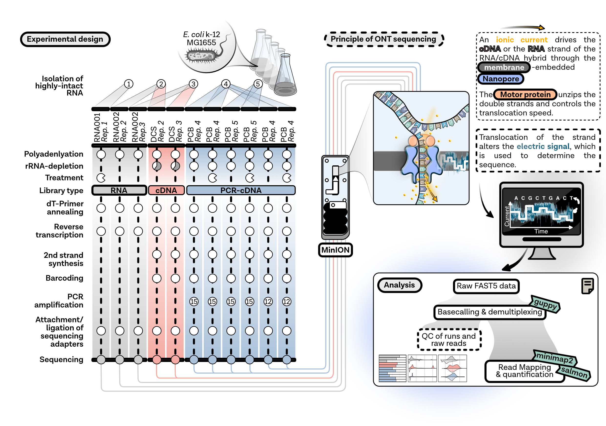

## Project 
At the beginning of this project, there was no comprehensive analysis of Nanopore sequencing of RNA and cDNA molecules using 3rd generation Nanopore technology in **prokaryotes** available.
Therefore, the aim of this study was to benchmark current RNA-seq protocols provided by [Oxford Nanopore Technologies](http://nanoporetech.com) using *Escherichia coli* as one of the most popular bacterial model organisms. We were especially interested, how well Nanopore sequencing captures multiple transcriptomic features at once and how the data compare to similar protocols, like [SMRT-Cappable-seq](https://www.nature.com/articles/s41467-018-05997-6).  
  
Here, we would like give a more detailed description of project planning, experimental design and the individual steps of the analysis using tools and scripts developed by ONT, many other developers and ourselfs.  

<figure>
   
   
   
   <figcaption>Figure description</figcaption>
</figure>

  